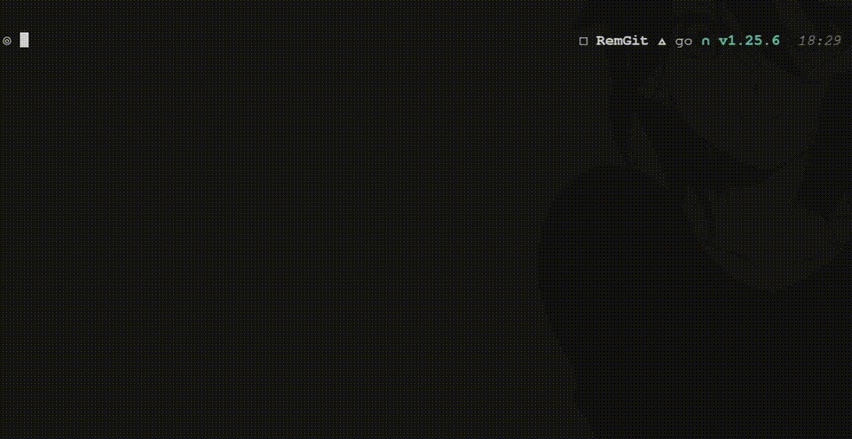
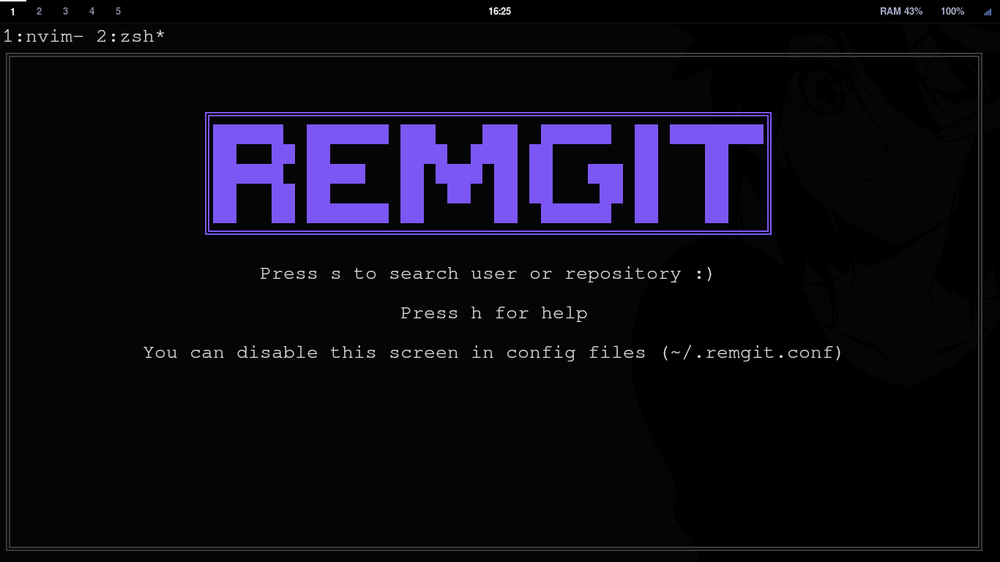
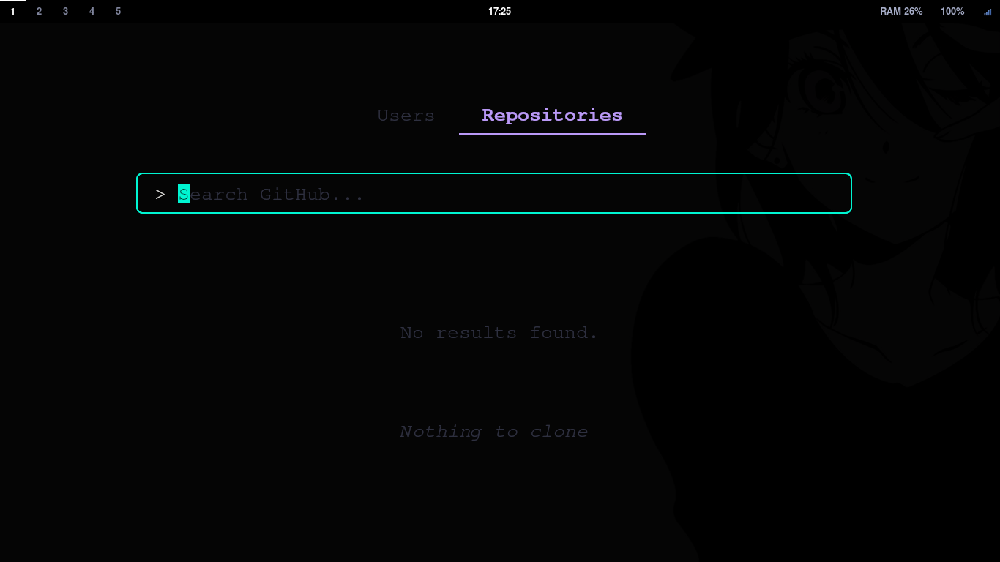
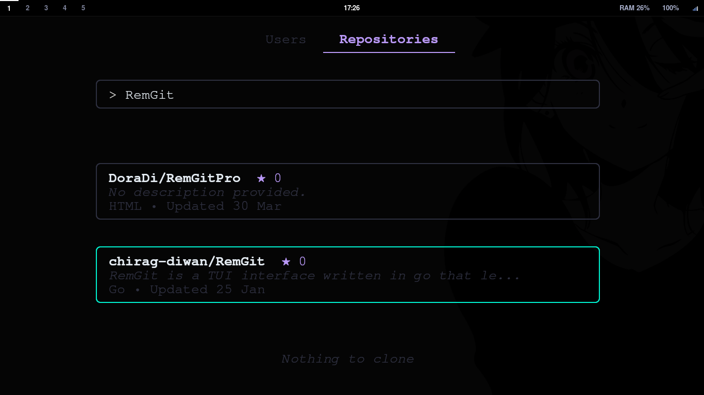
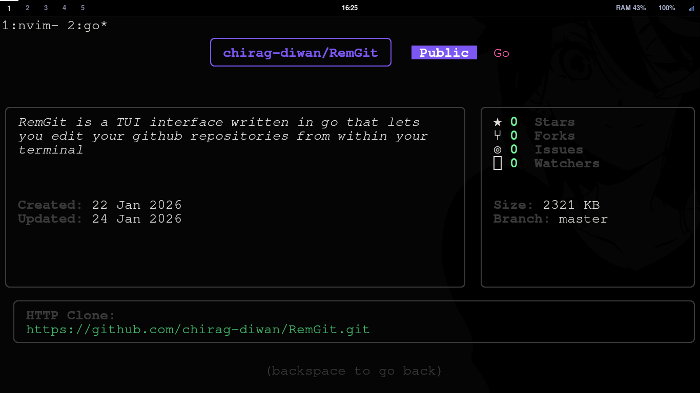
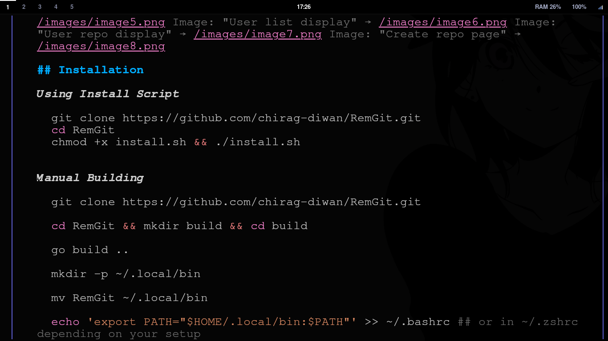
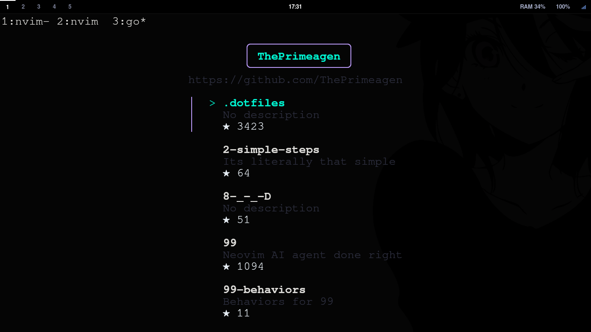
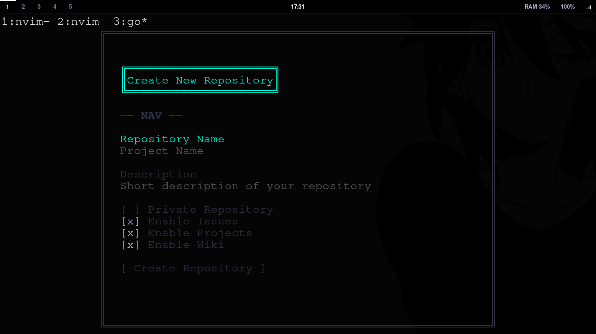

# RemGit



RemGit is a GitCli that lets you search and make repos , search users , clone repos all from within your terminal 









## Installation

***Using Install Script***
```bash
git clone https://github.com/chirag-diwan/RemGit.git
cd RemGit
chmod +x install.sh && ./install.sh

```


***Manual Building***
```bash
git clone https://github.com/chirag-diwan/RemGit.git

cd RemGit && mkdir build && cd build

go build ..

mkdir -p ~/.local/bin

mv RemGit ~/.local/bin

echo 'export PATH="$HOME/.local/bin:$PATH"' >> ~/.bashrc ## or in ~/.zshrc depending on your setup

source ~/.bashrc
```


## Using RemGit

Typing RemGit in your terminal after installation will display the homepage for RemGit,
type `s` at the homepage to enter search mode.

In search mode you can hit `tab` to change search mode between user and repo. Hit `Enter` to start search .

Typing will write text in the searchbar Hitting `Enter` will search for the text in the respective domain (User vs Repository)

After the search result appears you are put into`Normal Mode` where you could navigate the list using `j` or `down` for down and `k` or `up` for up.

Hiting `Enter` on a search result will open details for the selected item

Hiting `c` on a repository item will clone it into the directory you are in.

Hiting `backspace` on details page will navigate you back 

Hitting `esc` and `m` will open repo creation page (m for making) hitting `esc` or `backspace` on the repo creation page will take you back to `search page`

## Configuration

The config lives in `~/.remgit.conf` file on you system , below is a overview of the configuration that is supported.

```conf
// Startup settings
Showhome = true


// Images Quality Setting 
Imgstyle = halfblocks

//Images Height and Width Cap (in number of rows / cols )
Imgh = 20
Imgw = 60
// -----------------------------------------------------
// UI Colors — Neon Cyberpunk
// -----------------------------------------------------

// Subtle: Dark neon steel blue
Subtle = #2a2d3e

// Highlight: Electric purple (primary accent)
Highlight = #00f5d4

// Text: Bright cool white
Text = #e6edf3

// Warning: Hot neon red-pink
Warning = #ff5c8a

// Special: Neon cyan
Special = #bb9af7
```
